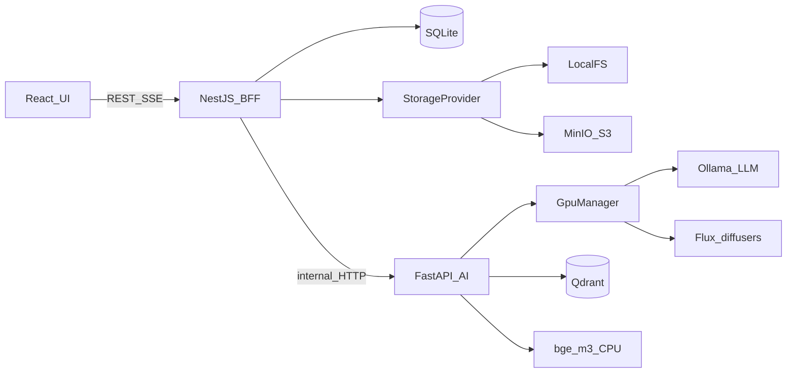

# План: локальный генератор постов (RAG + Ollama + Flux)

Код на этом шаге не пишем. После утверждения плана идём **строго по одному этапу**, с микро-планом и OK перед стартом этапа.

## 1. Архитектура верхнего уровня

**Принцип:** браузер говорит только с NestJS. Python — изолированный AI-воркер с эксклюзивным доступом к GPU. Docker — только безGPU-инфраструктура (Qdrant, опционально MinIO). Ollama и Flux живут на хосте Windows, не в контейнерах (GPU passthrough через Docker Desktop/WSL2 на этой машине — лишний риск).

```
┌─────────────────────────────────────────────────────────────────┐
│  Browser  React + Vite + shadcn/ui                              │
│           REST + SSE (EventSource)                              │
└────────────────────────────┬────────────────────────────────────┘
                             │ :5173 → :3000
┌────────────────────────────▼────────────────────────────────────┐
│  NestJS BFF                                                     │
│  - REST: library / posts / presets / generate                   │
│  - SQLite (Prisma): метаданные, полный текст, статусы           │
│  - StorageProvider: LocalFs | S3(MinIO)                         │
│  - SSE proxy → Python                                           │
│  - фоновые джобы индексации (статус в БД, не блокирует HTTP)    │
└────────────────────────────┬────────────────────────────────────┘
                             │ HTTP :8000 (внутренняя сеть)
┌────────────────────────────▼────────────────────────────────────┐
│  Python FastAPI  (venv, CUDA)                                   │
│  ┌──────────────┐  ┌─────────────┐  ┌─────────────────────────┐ │
│  │ GpuManager   │  │ RagService  │  │ Pipeline (SSE events)   │ │
│  │ asyncio.Lock │  │ parsers     │  │ text → image_prompt →   │ │
│  │ tenants:     │  │ chunker     │  │ image                   │ │
│  │  LLM|EMBED|  │  │ embedder    │  └─────────────────────────┘ │
│  │  FLUX        │  │ qdrant      │                              │
│  └──────┬───────┘  └──────┬──────┘                              │
└─────────┼─────────────────┼─────────────────────────────────────┘
          │                 │
   ┌──────▼──────┐   ┌──────▼──────┐   ┌──────────┐   ┌─────────┐
   │ Ollama :11434│   │ Qdrant :6333│   │ Flux     │   │ Storage │
   │ LLM (+opt.  │   │ Docker      │   │ diffusers│   │ FS/S3   │
   │ embed)      │   │             │   │ venv     │   │         │
   └─────────────┘   └─────────────┘   └──────────┘   └─────────┘
```




**Зачем три процесса, а не «всё в Python» или «всё в Nest»**

- **Python** — единственное разумное место для `diffusers`, PyMuPDF, чанкинга, Qdrant-клиента и CUDA. NestJS сюда не лезет.
- **NestJS** — BFF: загрузки файлов, SQLite, абстракция стораджа, валидация DTO, история, пресеты, прокси SSE. UI не знает про Ollama/Qdrant.
- **Ollama отдельно** — уже установлен, свой шедулер VRAM. Мы им **управляем** через GpuManager, а не встраиваем llama.cpp в FastAPI.
- **Qdrant в Docker** — штатный векторный движок, фильтры по `book_id`, переживает рестарт Python.
- **SQLite на Nest** — источник правды по постам/библиотеке/пресетам. Qdrant хранит только чанки. Файлы — в StorageProvider.

**Прямой вызов UI → FastAPI запрещён** (CORS, два источника правды, гонки GPU).

### Эксклюзивный GPU: GpuManager

Один процесс-владелец: FastAPI. Один `asyncio.Lock` на всю GPU. Три тенанта: `llm`, `embed` (если эмбеды через Ollama), `flux`. Одновременно активен только один.

Рекомендация, которая **меняет наивную схему «всё через Ollama»:** эмбеддинги `bge-m3` считать на **CPU** (`FlagEmbedding` / `sentence-transformers`), а не через Ollama. Иначе query-embed + `qwen3.5:9b` + KV-кэш 8–16k не влезут в 12 ГБ. Индексация больших книг тогда не конкурирует с LLM. GpuManager в этом варианте сериализует только **LLM ↔ Flux**.

Последовательность полного пайплайна поста:

1. `acquire(lock, tenant=llm)` — если Flux в VRAM, сначала `unload_flux()`.
2. RAG: CPU-embed запроса → Qdrant `top_k` с `filter book_id in selected`.
3. Ollama `/api/chat` stream, `keep_alive: "5m"` только на время текста.
4. Второй вызов той же LLM: промпт картинки (JSON: `prompt_en`, negative, style). Не грузим вторую модель.
5. `release_llm()`:
  - `POST /api/generate {"model": "<llm>", "keep_alive": 0}` на **каждую** загруженную модель из `GET /api/ps`;
  - fallback `ollama stop <name>`;
  - poll `ollama ps` пустой + `nvidia-smi` (used memory < порог, напр. 500 МБ) с таймаутом ~30 с.
6. `acquire(tenant=flux)` → ленивый load пайплайна (кэш в RAM/диске, в VRAM — только на генерацию).
7. Генерация, SSE `image_progress` (step/N).
8. `unload_flux()`: `pipe.to("cpu")` / `del pipe`, `gc.collect()`, `torch.cuda.empty_cache()`, `ipc_collect()`, poll `nvidia-smi`.
9. `release(lock)`. LLM **не** прогреваем заранее — загрузится на следующий текстовый запрос.

Защита от гонок: NestJS не вызывает `/generate/image` и `/generate/text` параллельно «в обход». Один pipeline-job id. Повторная генерация картинки — тот же lock. Индексация (CPU-embed) может идти параллельно с текстом; **не** параллельно с Flux (torch тоже может трогать CUDA). Поэтому индексные джобы тоже берут lock, если embedder/torch видит GPU — при CPU-only embed lock для индексации не нужен.

Конфиг: `GPU_FREE_MB_THRESHOLD`, `OLLAMA_HOST`, `LLM_MODEL`, `LLM_NUM_CTX=8192` (не 16384 — см. риски).

---

## 2. Структура репозитория

Монорепо **папками без Turborepo**. `pnpm-workspace.yaml` только на `frontend` + `backend`. Python — отдельный venv. Turborepo здесь оверкилл.

```
llm-keartin/
  README.md
  .gitignore
  .cursorrules
  pnpm-workspace.yaml
  docs/
    ARCHITECTURE.md
    GPU.md
    RAG.md
    DECISIONS.md          # принятые решения + дата
  docker/
    docker-compose.yml    # qdrant + minio
  frontend/               # Vite + React + TS + shadcn
  backend/                # NestJS
    src/
      library/ posts/ presets/ generate/ storage/ prisma/
  ai-service/
    pyproject.toml        # или requirements.txt — зафиксируем на этапе 0
    app/
      main.py
      api/                # routers: health, generate, rag, gpu
      gpu/manager.py
      llm/ollama_client.py
      image/flux_pipeline.py
      rag/{parsers,chunking,embedder,qdrant,indexer,retriever}
      pipeline/post_pipeline.py
      prompts/
    tests/
  scripts/
    start-dev.ps1
    check-gpu.ps1         # nvidia-smi + ollama ps
  data/                   # gitignore
    library/
    posts/
    sqlite/app.db
  .env.example
```

Артефакты генерации **не** в git. Каталоги `posts/` и `library/` — рабочие данные под `data/`.

---

## 3. Этапы разработки

Реалистичный горизонт: **не один вечер**, а 8 итераций (этап 2 и 3 — самые рискованные по VRAM и парсерам).

### Этап 0. Каркас

**Цель.** Пустой монорепо поднимается: Docker (Qdrant, MinIO), Nest `/health`, FastAPI `/health`, Vite dev, README + архитектура.

**Задачи.** Gitignore; `.env.example` с `HF_HOME=D:/huggingface_cache`, `HUGGINGFACE_HUB_CACHE`, `TRANSFORMERS_CACHE`; `docs/ARCHITECTURE.md` (черновик, который потом только уточняем); `.cursorrules` (стек, GPU-lock, «не ходи в UI из Python»); compose; init NestJS + Prisma SQLite (пока одна таблица Health/noop); Vite+React+shadcn (пустой layout); FastAPI с `/health` (python, torch CUDA available?, ollama ping, qdrant ping); `scripts/start-dev.ps1` выставляет HF-кэш до старта Python.

**Файлы.** Всё дерево выше без бизнес-логики. `frontend/src/pages` — заглушки. `ai-service/app/gpu/manager.py` — **интерфейс-заглушка** (`acquire/release`, ещё без Ollama stop).

**Решения этапа.** Python 3.11+; FastAPI+uvicorn; Nest 10/11; pnpm; Prisma; порт 3000/5173/8000/6333/9000; Storage ещё не подключаем, MinIO просто живёт в compose.

**Проверка.** `docker compose up -d` → Qdrant `:6333/readyz`; FastAPI `GET /health` → `{ollama, qdrant, cuda}`; Nest `GET /health`; Vite открывается. Без генерации.

**Зависимости.** Нет.

---

### Этап 1. Локальная генерация текста

**Цель.** Стрим токенов из Ollama через FastAPI, без RAG и без картинки.

**Задачи.** `OllamaClient`: chat+generate, stream NDJSON; выбор модели из env; `POST /generate/text` (sync JSON) и `POST /generate/text/stream` (SSE); `keep_alive` настраиваемый; системный промпт-заглушка «напиши пост».

**Файлы.** `ai-service/app/llm/ollama_client.py`, `api/generate.py`, `prompts/text_system.md`.

**Решения.** Основная LLM: `**qwen3.5:9b-16k`**, но `options.num_ctx: 8192` (16k KV на 9B ≈ ещё ~4+ ГБ — риск OOM рядом с эмбедом/остатком драйвера). Вспомогательную **не грузим**: промпт картинки позже той же моделью. `qwen2.5:7b-instruct` — запасной `LLM_MODEL` в .env, не второй процесс.

**Проверка.** `curl` stream: тема «привычка читать 20 минут» → русские токены в SSE. `ollama ps` показывает модель. После `keep_alive:0` — `ollama ps` пуст.

**Зависимости.** Этап 0.

---

### Этап 2. Flux + GpuManager

**Цель.** Картинка с гарантированной выгрузкой. Самый опасный этап по железу.

**Задачи.** Реализовать GpuManager полностью (ps → stop → poll VRAM → flux → unload → poll). Обёртка Flux: repo id из `HF_HOME` (`D:/huggingface_cache`); `FLUX_MODEL_PATH` — опциональный override (GGUF). Стратегия загрузки (порядок fallback):

1. **Рабочий путь для 12 ГБ:** transformer + T5 в **bitsandbytes NF4** + `enable_sequential_cpu_offload()` (или `enable_model_cpu_offload()`). FP16 (~24–31 ГБ) и BnB8 (peak ~24 ГБ) **не влезут**. BnB4 без offload peak ~17 ГБ — тоже нет.
2. Если Windows+bitsandbytes сломается: GGUF Q5_K_S / Q6_K через diffusers GGUF-квантайзер (отдельный файл модели, путь в env).
3. FP8 transformer — только если после unload Ollama `nvidia-smi` стабильно даёт ~11 ГБ свободно **и** T5 тоже FP8; на 12 ГБ это впритык, не первый путь.

Кэш пайплайна: держать веса в RAM/на диске, в VRAM — только на время `generate`. `POST /generate/image` + SSE progress. После запроса — принудительный unload.

**Файлы.** `gpu/manager.py`, `gpu/nvidia.py` (парс `nvidia-smi --query-gpu=memory.used`), `gpu/ollama_unload.py`, `image/flux_pipeline.py`, `docs/GPU.md`.

**Решения.** Размер по умолчанию 1024×1024, 20–28 steps, seed в ответе. Не тащить ComfyUI. Не класть Flux в Docker.

**Проверка.** Скрипт: загрузить LLM → сгенерировать 1 картинку → `nvidia-smi` до/после. Ожидание: во время Flux нет строк в `ollama ps`; после — память GPU близка к idle. Регрессия: повторный вызов не течёт по VRAM.

**Зависимости.** Этап 1 (unload LLM должен работать).

---

### Этап 3. RAG

**Цель.** Книга → чанки → Qdrant → релевантный поиск с фильтром по источникам.

**Задачи.** Парсеры: PDF **PyMuPDF**; EPUB **ebooklib**; FB2 **lxml** (FB2 = XML; тонкая обёртка, не хрупкий pip-only `fb2reader` как единственный путь); DOCX **python-docx**; TXT **charset-normalizer**. Нормализация в плоский текст + оглавление/главы если есть. Чанкер: 500–800 токенов ≈ 2000–3200 символов, overlap ~400 символов (~100 токенов), граница по абзацу. Embed: **BAAI/bge-m3**, 1024 dim, CPU, веса из того же `HF_HOME`. Qdrant collection `library_chunks`, payload: `book_id`, `chunk_index`, `source_name`, `lang`. Переиндексация: delete by `book_id` + upsert. `POST /rag/index`, `POST /rag/search`, статус `queued|indexing|ready|error`.

**Файлы.** `rag/parsers/*.py`, `chunking.py`, `embedder.py`, `qdrant_store.py`, `indexer.py`, `retriever.py`. Тесты на маленьких фикстурах (1–2 страницы каждого формата).

**Решения.** Не LangChain. top_k default 10 (диапазон 8–12). Мультиязычность: bge-m3, чанки как есть (RU/EN в одной коллекции). Для FB2 выкидывать binary/cover, брать `body` + `title-info`. EPUB: собирать spine HTML → text, не картинки.

**Проверка.** Залить TXT/PDF на русском → search «цитата из книги» → чанки с нужным `book_id`. Фильтр по другому id — пусто. Книга 100+ стр. — прогресс, не таймаут HTTP (202 + poll).

**Зависимости.** Этап 0 (Qdrant). GPU не обязателен.

---

### Этап 4. Полный AI-pipeline

**Цель.** Один SSE-поток: retrieve → текст поста → промпт картинки → exclusive Flux → артефакты в temp.

**Задачи.** Сборка промпта: режимы `rag | rag_plus | general`; цитируемость; структура hooks/body/cta; тон, длина, эмодзи; пресет (описание + few-shot). События SSE: `status`, `token`, `text_done`, `image_prompt`, `gpu_unload_llm`, `image_progress`, `image_done`, `error`. Сохранение пока в temp-директорию pipeline (Nest подхватит на этапе 5).

**Файлы.** `pipeline/post_pipeline.py`, `prompts/post_ru.md`, `prompts/image_prompt.md`, схемы Pydantic запросов.

**Решения.** Промпт картинки — **английский** (Flux так лучше), текст поста — русский. CTA/хуки — если выключены, секций нет. Если RAG пустой в режиме `rag` — ошибка «недостаточно контекста», не галлюцинация.

**Проверка.** E2E curl/httpie: одна книга + тема → в логе видна выгрузка LLM перед Flux → файлы `post.txt` + `image.png`. Повторная картинка без текста — отдельный endpoint.

**Зависимости.** Этапы 1–3.

---

### Этап 5. NestJS-бэкенд

**Цель.** Продуктовый API для UI. Python остаётся внутренним.

**Задачи.** Prisma-модели: `Book`, `Post`, `StylePreset`, `GenerationJob`. REST: library CRUD + reindex; posts CRUD + open-folder; presets CRUD; `POST /generate/posts` → job + SSE `/generate/posts/:id/events`. StorageProvider: `LocalFsProvider` (вариант A: `data/posts/YYYY-MM-DD_slug/`, `data/library/<book-id>/`); `S3Provider` (MinIO). В SQLite — полный текст + ключ картинки + мета (тема, тон, длина, режим, presetId, imageSeed, models, sources[], dates). Прокси ошибок GPU/Ollama. `POST` regenerate text / regenerate image.

**Файлы.** `backend/src/`** модули, `prisma/schema.prisma`, `storage/`.

**Решения.** Prisma + SQLite. Job в памяти + статус в БД (рестарт Nest помечает висящие jobs failed). Open folder: `explorer.exe` путь (Windows). Файлы книг копируются в library storage до индексации.

**Проверка.** REST-клиент без UI: upload PDF → ready → generate → запись в SQLite и папка с 4 файлами (`post.md`, `post.txt`, `image.png`, `image_prompt.txt`, `meta.json`). Переключение `STORAGE_DRIVER=s3` — тот же сценарий в MinIO.

**Зависимости.** Этап 4.

---

### Этап 6. Frontend

**Цель.** Четыре экрана, стриминг, без WYSIWYG.

**Экраны.** Библиотека; Создание поста (мастер: источники → параметры → generate); История; Пресеты. shadcn: Button, Card, Select, Switch, Textarea, Dialog, Progress, Tabs, Sidebar.

**Задачи.** TanStack Query + EventSource; превью текста по мере токенов; прогресс картинки; кнопки «перегенерировать текст/картинку»; «открыть папку»; статусы индексации; пустые/ошибки.

**Файлы.** `frontend/src/pages/`*, `components/*`, `api/client.ts`, `hooks/useSse.ts`.

**Решения.** React Router. Тема — нейтральная светлая/тёмная shadcn default. Длина: S/M/L (например 500 / 1200 / 2500 символов) — соцсеть не хардкодим. Проверка UI в браузере: загрузка, стрим, превью, история, пресет.

**Зависимости.** Этап 5.

---

### Этап 7. Полировка

**Цель.** Поведение «как продукт», не новые подсистемы.

**Задачи.** CRUD пресетов довести (валидация few-shot); отмена job (abort Ollama stream + не стартовать Flux); человекочитаемые ошибки VRAM/Ollama down/пустой RAG; логирование (структурные логи Python + Nest); UX: disable кнопок пока GpuManager busy (`GET /gpu/status`); seed картинки в UI; дописать ARCHITECTURE.md по факту.

**Проверка.** Чеклист: большая книга; regenerate image only; удаление книги чистит Qdrant; MinIO toggle; два параллельных generate — второй ждёт или 409.

**Зависимости.** Этап 6.

---

## 4. Решения, которые нужно согласовать

Предлагаю принять как дефолт (менять до этапа 0):

1. **LLM:** `qwen3.5:9b-16k` + `num_ctx=8192`. Не 7b как основная (хуже русский и стиль). Не грузить вторую LLM. 7b — только fallback в env.
2. **Embeddings:** `bge-m3` (1024d, RU+EN, длинный вход). **Через sentence-transformers/FlagEmbedding на CPU**, не через Ollama. `nomic-embed-text` не использовать. Альтернатива, если CPU-индексация слишком медленная: Ollama `bge-m3`, но тогда GpuManager обязан выгружать эмбед перед LLM.
3. **Парсеры:** PyMuPDF, ebooklib, lxml/FB2, python-docx, charset-normalizer. Не Unstructured (тяжёлый).
4. **Flux:** BnB NF4 + sequential CPU offload из кэша `HF_HOME=D:/huggingface_cache` (repo id `black-forest-labs/FLUX.1-dev`). Fallback GGUF Q5/Q6 через опциональный `FLUX_MODEL_PATH`. ComfyUI не вносим.
5. **Unload Ollama:** API `keep_alive: 0` по всем `ollama ps`, затем `ollama stop`, затем poll `nvidia-smi`. Не `taskkill` Ollama.
6. **Qdrant** — оставляем. Chroma проще, но фильтры/переиндексация слабее; pgvector тащит Postgres зря.
7. **SSE**, не WebSocket: однонаправленный прогресс, нативно через Nest `@Sse` + EventSource.
8. **SQLite** на Nest. Postgres не нужен. Полный текст поста в БД — ок (посты короткие). Книги в БД не кладём, только мета + storage key.
9. **Монорепо:** папки + pnpm workspaces на JS. Без Turborepo/Nx.
10. **Сторадж по умолчанию:** локальные папки (A). MinIO в compose с этапа 0, драйвер S3 включаем на этапе 5. Не оба сразу в UI.
11. **Авторизации нет** (localhost, один пользователь).
12. **Соцсеть не фиксируем** — длина S/M/L и структура блоков.
13. **Кэш Hugging Face:** `HF_HOME` / `HUGGINGFACE_HUB_CACHE` / `TRANSFORMERS_CACHE` как в `example/config.py`. Все HF-модели (Flux, bge-m3, следующие) только туда. Env до импорта библиотек. Не `%USERPROFILE%\.cache\huggingface`.

`FLUX_MODEL_PATH` нужен только если GGUF или снимок лежит вне `D:/huggingface_cache`. Иначе этап 2 грузит Flux из существующего HF-кэша. Если снимок полный BF16 — на этапе 2 квантуем при загрузке, не гоняем FP16.

---

## 5. Риски и узкие места

- **12 ГБ VRAM.** FP16 Flux не влезет (~31 ГБ). FP8 впритык. Рабочий коридор: NF4+offload или GGUF Q5/Q6. Пик во время VAE-decode тоже считать. Windows CUDA-контекст Ollama может **не отдать** память сразу — poll + повторный stop, не вера в один вызов.
- **Пересечение Ollama и Flux.** Только lock + проверка `ollama ps` + порог nvidia-smi. Любой прямой вызов Ollama в обход GpuManager — баг. Cursor-правило в `.cursorrules`.
- **16k контекст 9B.** KV-кэш съест карту. Жёсткий `num_ctx=8192`. RAG top_k=10 × ~600 ток. ≈ 6k + system — влезает.
- **FB2/EPUB.** Пространства имён FB2, zip-epub с битым HTML, сноски, сноски-графика. Парсер обязан возвращать «мягкую» ошибку на файл, не валить всю библиотеку. EPUB: только spine, выкидывать nav/css.
- **Русский.** LLM — Qwen (нормально). Embed — только m3, не nomic. Промпт Flux — EN-перевод/генерация отдельным шагом, иначе картинки хуже.
- **Долгая индексация.** HTTP 202 + job status + SSE/poll. Chunk+embed батчами, чтобы UI видел «стр. 40/400».
- **SQLite и большие тексты.** Посты — мелкие. Не класть исходники книг в SQLite (десятки МБ PDF).
- **bitsandbytes на Windows.** Исторически ломкий. Этап 2 закладывает GGUF-fallback в тот же GpuManager, не «потом когда-нибудь».
- **Лицензия FLUX.1-dev** — non-commercial. Для личного локального ок; в README явно написать.
- **32 ГБ RAM.** NF4 offload + 9B в RAM + Qdrant + Chrome — терпимо, но не держать Flux в VRAM «на всякий случай».
- **HF-кэш не на D:.** Без `HF_HOME` веса уедут в `%USERPROFILE%\.cache\huggingface` на C: и скачаются второй раз.

---

## 6. Формат дальнейшей работы

Подтверждаю регламент:

1. План утверждён → **только этап N**, не «заодно этап N+1».
2. Перед этапом — короткий микро-план (файлы, контракты API, критерии приёмки) → жду OK.
3. После этапа — отчёт: что сделано, как проверить, что не вошло, риски → жду подтверждение.
4. Каждый этап заканчивается правкой `[docs/ARCHITECTURE.md](docs/ARCHITECTURE.md)` (и GPU/RAG по мере появления).
5. Код пишем только после OK на текущий этап.

Первый рабочий шаг после вашего «план ок»: микро-план **этапа 0** (каркас, health-checks, compose, .cursorrules).