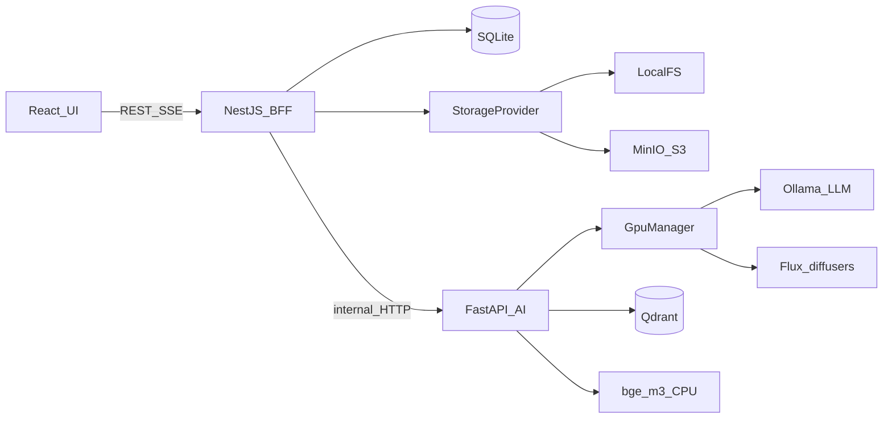

# Архитектура верхнего уровня

Целевая схема продукта. Факт после этапа 1 — в [docs/ARCHITECTURE.md](../ARCHITECTURE.md): health, стрим Ollama, stub GpuManager; без RAG/Flux.

## Принцип

Браузер говорит **только с NestJS**. Python — изолированный AI-воркер с эксклюзивным доступом к GPU. Docker — только безGPU-инфраструктура (Qdrant, опционально MinIO). Ollama и Flux живут на **хосте Windows**, не в контейнерах: GPU passthrough через Docker Desktop/WSL2 на этой машине — лишний риск.

Прямой вызов UI → FastAPI **запрещён** (CORS, два источника правды, гонки GPU).

## Диаграмма компонентов

```
┌─────────────────────────────────────────────────────────────────┐
│  Browser  React + Vite + shadcn/ui                              │
│           REST + SSE (EventSource)                              │
└────────────────────────────┬────────────────────────────────────┘
                             │ :5173 → :3000
┌────────────────────────────▼────────────────────────────────────┐
│  NestJS BFF                                                     │
│  - REST: library / posts / presets / generate                   │
│  - SQLite (Prisma): метаданные, полный текст, статусы           │
│  - StorageProvider: LocalFs | S3(MinIO)                         │
│  - SSE proxy → Python                                           │
│  - фоновые джобы индексации (статус в БД, не блокирует HTTP)    │
└────────────────────────────┬────────────────────────────────────┘
                             │ HTTP :8000 (внутренняя сеть)
┌────────────────────────────▼────────────────────────────────────┐
│  Python FastAPI  (venv, CUDA)                                   │
│  ┌──────────────┐  ┌─────────────┐  ┌─────────────────────────┐ │
│  │ GpuManager   │  │ RagService  │  │ Pipeline (SSE events)   │ │
│  │ asyncio.Lock │  │ parsers     │  │ text → image_prompt →   │ │
│  │ tenants:     │  │ chunker     │  │ image                   │ │
│  │  LLM|EMBED|  │  │ embedder    │  └─────────────────────────┘ │
│  │  FLUX        │  │ qdrant      │                              │
│  └──────┬───────┘  └──────┬──────┘                              │
└─────────┼─────────────────┼─────────────────────────────────────┘
          │                 │
   ┌──────▼──────┐   ┌──────▼──────┐   ┌──────────┐   ┌─────────┐
   │ Ollama :11434│   │ Qdrant :6333│   │ Flux     │   │ Storage │
   │ LLM          │   │ Docker      │   │ diffusers│   │ FS/S3   │
   └─────────────┘   └─────────────┘   └──────────┘   └─────────┘
```



## Зачем три процесса

| Процесс | Зачем существует |
|---------|------------------|
| **Python FastAPI** | Единственное разумное место для `diffusers`, PyMuPDF, чанкинга, Qdrant-клиента и CUDA. NestJS сюда не лезет. |
| **NestJS** | BFF: загрузки файлов, SQLite, сторадж, валидация DTO, история, пресеты, прокси SSE. UI не знает про Ollama/Qdrant. |
| **Ollama** | Уже установлен, свой шедулер VRAM. Управляем через GpuManager, не встраиваем llama.cpp в FastAPI. |
| **Qdrant в Docker** | Штатный векторный движок, фильтры по `book_id`, переживает рестарт Python. |
| **SQLite на Nest** | Источник правды по постам / библиотеке / пресетам. Qdrant хранит только чанки. Файлы — в StorageProvider. |

## Порты (зафиксировать на этапе 0)

| Сервис | Порт |
|--------|------|
| Vite | 5173 |
| NestJS | 3000 |
| FastAPI | 8000 |
| Qdrant | 6333 |
| MinIO API | 9000 |
| MinIO Console | 9001 |
| Ollama | 11434 |

## Эксклюзивный GPU: GpuManager

Один процесс-владелец: FastAPI. Один `asyncio.Lock` на всю GPU.

Тенанты: `llm`, `embed` (если эмбеды через Ollama), `flux`. Одновременно активен только один.

### Важное отклонение от «всё через Ollama»

Эмбеддинги `bge-m3` считаем на **CPU** (`FlagEmbedding` / `sentence-transformers`), а не через Ollama. Иначе query-embed + `qwen3.5:9b` + KV-кэш 8–16k не влезут в 12 ГБ. Индексация больших книг тогда не конкурирует с LLM.

В этом варианте GpuManager сериализует только **LLM ↔ Flux**.

Если позже эмбеды переведём на Ollama — тенант `embed` становится обязательным, и перед LLM эмбед надо выгружать.

### Последовательность полного пайплайна поста

1. `acquire(lock, tenant=llm)` — если Flux в VRAM, сначала `unload_flux()`.
2. RAG: CPU-embed запроса → Qdrant `top_k` с фильтром `book_id in selected`.
3. Ollama `/api/chat` stream, `keep_alive: "5m"` только на время текста.
4. Второй вызов **той же** LLM: промпт картинки (JSON: `prompt_en`, negative, style). Вторую модель не грузим.
5. `release_llm()`:
   - `POST /api/generate {"model": "<name>", "keep_alive": 0}` на **каждую** загруженную модель из `GET /api/ps`;
   - fallback `ollama stop <name>`;
   - poll: `ollama ps` пустой **и** `nvidia-smi` (used memory < порог, например 500 МБ), таймаут ~30 с.
6. `acquire(tenant=flux)` → ленивый load пайплайна (кэш весов в RAM/на диске; в VRAM — только на генерацию).
7. Генерация, SSE `image_progress` (step/N).
8. `unload_flux()`: `pipe.to("cpu")` / `del pipe`, `gc.collect()`, `torch.cuda.empty_cache()`, `ipc_collect()`, poll `nvidia-smi`.
9. `release(lock)`. LLM **не** прогреваем заранее — загрузится на следующий текстовый запрос.

### Защита от гонок

- NestJS не вызывает `/generate/image` и `/generate/text` параллельно «в обход» пайплайна.
- Один pipeline-job id.
- Повторная генерация картинки — тот же lock.
- CPU-embed индексация может идти параллельно с текстом.
- Индексация **не** параллельно с Flux (torch может трогать CUDA). Если embedder/torch видит GPU — индексная джоба тоже берёт lock. При CPU-only embed lock для индексации не нужен.
- Любой прямой вызов Ollama в обход GpuManager — баг. Правило в `.cursorrules`.

### Конфиг GpuManager

- `GPU_FREE_MB_THRESHOLD` (например 500)
- `OLLAMA_HOST`
- `LLM_MODEL`
- `LLM_NUM_CTX=8192` (не 16384)
- `FLUX_MODEL_ID` (дефолт `black-forest-labs/FLUX.1-dev`) — загрузка из HF-кэша
- `FLUX_MODEL_PATH` — опциональный override (GGUF или снимок вне кэша)
- `FLUX_QUANT` (`nf4` | `gguf`)

### Кэш Hugging Face

Один каталог на хосте для Flux, `bge-m3` и любых следующих HF-моделей. Не класть в Docker и не в `data/`.

Значения по умолчанию (как в `example/config.py`):

```
HF_HOME=D:/huggingface_cache
HUGGINGFACE_HUB_CACHE=D:/huggingface_cache/hub
TRANSFORMERS_CACHE=D:/huggingface_cache/transformers
```

Переменные задавать **до импорта** `transformers` / `diffusers` / `sentence-transformers` / `huggingface_hub` (они читают env на импорте): загрузка `.env` в самом верху `ai-service` и дублирование в `scripts/start-dev.ps1`. Хардкод пути в код не писать — только `.env`.
